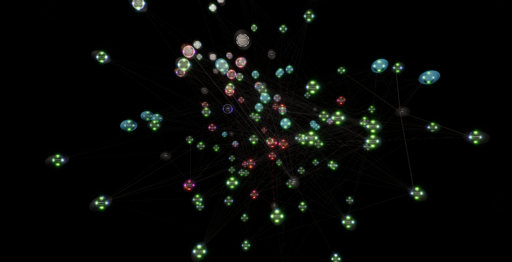

# OpenTelemetry Trace Generator

A single-binary distributed trace generator that produces realistic, topology-rich OTLP traces. No Docker, no microservices to deploy, no infrastructure - just one executable that simulates a full e-commerce platform with up to 28 services, 60 pods, and 20 scenario flows - including AI agentic scenarios with full OTel GenAI semantic conventions. Three complexity levels (light/normal/heavy) let you scale from a clean 10-service demo to the full topology with AI.

Built for testing observability platforms, load testing trace pipelines, and showcasing distributed system visualizations - for both traditional APM and LLM observability.



## Why This Exists

Every existing trace generator falls into one of two categories:

1. **Flat span generators** (telemetrygen, tracepusher) - produce uniform, identical spans with no service topology
2. **Full demo apps** (OTel Astronomy Shop, Jaeger HotROD) - require Docker Compose with 15+ containers and 8GB RAM

And none of them generate **AI agentic traces**. The LLM observability market has no standalone tool that combines traditional APM with LLM observability. Every specialized LLM tool (Langfuse, LangSmith, Helicone, Arize, Traceloop, Portkey, Galileo) tracks token usage, model costs, and agent tool calls - but none of them provide traditional distributed tracing.

This tool generates **topology-rich, failure-injectable traces from a single binary** - covering both traditional microservice flows AND AI agentic patterns with OTel GenAI semantic conventions. One binary proves that a platform can visualize both.

## Built with Jerry

This project was designed and validated using the [Jerry Framework](https://github.com/geekatron/jerry/) ([docs](https://jerry.geekatron.org/)) - an AI-native systems engineering framework for Claude Code.

- **Adversarial quality review** - Every scenario flow and chaos/failure mode was stress-tested using Jerry's `/adversary` skill. The adversarial review challenged trace realism, span attribute completeness, failure propagation correctness, and edge-case coverage. Each scenario was scored against adversarial templates and iterated until it passed.

- **Red team validation** - Jerry's `/red-team` skill probed the tool from an offensive security perspective - verifying that generated traces don't leak secrets, that the binary doesn't introduce supply-chain risk, and that the OTLP output conforms to spec even under chaos conditions.

- **NASA-grade systems engineering** - The requirements, architecture, and verification matrix were driven through Jerry's `/nasa-se` skill (implementing NPR 7123.1D processes). Requirements traceability, verification coverage, and risk disposition all met mission-grade thresholds before the first release.

The combination of `/adversary`, `/red-team`, and `/nasa-se` is why a single developer could ship a tool with 28 services, 59 pods, 40 flows, and 10 failure modes - with confidence that it actually works correctly.

## Quick Start

```bash
# Download the latest release (or build from source)
go install github.com/ImmersiveFusion/if-opentelemetry-tracegen/cmd/tracegen@latest

# Run with your OTLP endpoint
tracegen -apikey YOUR_API_KEY -endpoint your-otlp-endpoint:443

# Or set the API key via environment variable
export OTEL_APIKEY=YOUR_API_KEY
tracegen -endpoint your-otlp-endpoint:443
```

> **See it in 3D** - The default endpoint (`otlp.iapm.app`) sends traces straight to [Immersive APM](https://immersivefusion.com), where you can explore them as a 3D force-directed graph, drill into conventional trace waterfalls for detailed analysis, and get AI-assisted insights from [Tessa](https://immersivefusion.com). For a ready-made example without any setup, try the [OpenTelemetry Chaos Simulator](https://github.com/ImmersiveFusion/if-opentelemetry-chaos-simulator-sample) at [demo.iapm.app](https://demo.iapm.app) - a fully interactive sandbox with visual failure injection.

## Features

### 28 Microservices

#### Traditional Services (20)

| Service | Pods | Role |
|---|---|---|
| web-frontend | 2 | Browser client, SPA |
| api-gateway | 3 | HTTP routing, auth |
| order-service | 3 | Order lifecycle |
| payment-service | 2 | Stripe integration |
| inventory-service | 2 | Stock management |
| notification-service | 2 | Event-driven notifications |
| user-service | 2 | Auth, profiles |
| cache-service | 3 | Redis cluster |
| search-service | 2 | Elasticsearch queries |
| scheduler-service | 1 | Cron jobs (singleton) |
| auth-service | 3 | JWT, webhook verification |
| recommendation-service | 2 | ML-based recommendations |
| cart-service | 2 | Shopping cart |
| product-service | 3 | Product catalog |
| shipping-service | 2 | Rates, labels, tracking |
| fraud-service | 2 | ML fraud scoring |
| email-service | 2 | SMTP relay (SendGrid) |
| tax-service | 1 | Tax calculation |
| analytics-service | 3 | Event tracking (Kafka) |
| config-service | 1 | Feature flags |

#### AI Services (8)

| Service | Pods | Role |
|---|---|---|
| llm-gateway | 3 | OpenAI API routing, token tracking |
| embedding-service | 2 | Text-to-vector operations |
| vector-db-service | 2 | Qdrant similarity search |
| ai-agent-service | 2 | Agent orchestration (plan/act/reflect) |
| content-moderation-service | 2 | Safety classifiers, PII detection |
| model-registry-service | 1 | Model versioning (singleton) |
| feature-store-service | 2 | ML feature serving |
| data-pipeline-service | 2 | Batch embedding, retraining |

All 59 pods are distributed across 5 AKS VMSS nodes (2 node pools) with realistic `service.instance.id` and `host.name` resource attributes.

### 40 Scenario Flows

#### Traditional Scenarios (15 original + 13 new)

| Scenario | Graph Shape | Key Pattern |
|---|---|---|
| **Create Order** | Long chain (8 services, 14+ spans) | Producer/consumer with queue delays |
| **Search & Browse** | Linear with cache | Elasticsearch + Redis |
| **User Login** | Branching (success/failure) | Auth with session creation |
| **Failed Payment** | Error chain | Stripe 402 + error propagation |
| **Bulk Notifications** | Fan-out (3-5 parallel) | Batch email processing |
| **Health Check** | Star topology (6 parallel) | Concurrent health pings |
| **Inventory Sync** | Fan-out + reindex | Parallel cache warming |
| **Scheduled Report** | Headless chain (no UI) | Cron job entry point |
| **Stripe Webhook** | Headless chain (no gateway) | External callback entry |
| **Recommendations** | Scatter-gather / bowtie | Fan-out to 3, gather, cache |
| **Add to Cart** | Cross-service with feature flags | Config service + analytics |
| **Full Checkout** | Monster chain (15 services) | Tax+shipping parallel, fraud ML |
| **Shipping Update** | Carrier webhook (headless) | External webhook + email relay |
| **Saga Compensation** | Forward chain + 4-way compensation fan-out | Payment retries + rollback |
| **Timeout Cascade** | Branching with circuit breaker | Stale cache fallback |
| **User Registration** | Linear with async branch | Email verification token, duplicate detection |
| **Product Review** | Write + async moderation | Optimistic write + background processing |
| **Return/Refund** | Parallel reverse flow (16-18 spans) | Parallel refund + restock, reverse money flow |
| **Wishlist + Price Alert** | Write-through with async | Write-through cache, async price monitoring |
| **Coupon Application** | Validation chain | Cart recalculation, validation branch |
| **Gift Card Purchase** | Payment splitting | Balance check, payment splitting |
| **Subscription Management** | Webhook-driven lifecycle | Stripe subscription, renewal webhook |
| **A/B Test Exposure** | Feature flag branch | Variant assignment, sticky session |
| **Rate Limiting** | Early termination (4-6 spans) | Redis sliding window, 429 response |
| **Admin Product CRUD** | Write-amplification fan-out | Cache + search reindex on write |
| **Order History** | Paginated read | Keyset pagination, cursor-based |
| **Support Ticket** | Cross-domain trace | SLA assignment, team routing |
| **Multi-Currency Checkout** | External API chain | FX rate API, cache hit ratio |

#### AI Agentic Scenarios (12)

| Scenario | Graph Shape | Key Pattern |
|---|---|---|
| **Semantic Search (RAG)** | Linear with 2 LLM calls (14-16 spans) | Embedding + vector search + LLM reranking |
| **AI Chatbot with Tool Use** | Double bowtie (18-22 spans) | Plan -> fan-out tool calls -> synthesize |
| **AI Content Moderation** | Parallel classifiers + 3-way branch (12-16 spans) | Safety/spam scoring, guardrail decisions |
| **Multi-Step Agent** | Iterative loop (28-40 spans) | Plan -> act -> reflect cycle (3-5 iterations) |
| **AI Customer Support** | Branching with escalation (16-20 spans) | Sentiment classification, intent detection |
| **AI Content Generation** | Linear with safety filter (12-15 spans) | Temperature-controlled generation, content safety |
| **Embedding Pipeline** | High fan-out batch (25-40 spans) | Batch chunking, parallel embedding, vector upsert |
| **Dynamic Pricing Agent** | Headless agent (14-18 spans) | Feature store lookup, autonomous price updates |
| **Fraud with Explainability** | Linear with LLM explanation (10-12 spans) | SHAP-style feature attribution via LLM |
| **Inventory Reorder Agent** | Autonomous agent (16-20 spans) | Demand forecast, autonomous purchase orders |
| **Model Retraining Pipeline** | Batch pipeline (14-18 spans) | ML training spans, model registry, quality gate |
| **Conversational Commerce** | Multi-turn session (10-14 spans/turn) | Growing context tokens, session continuity |

> **Note:** Failed Payment, Saga Compensation, Timeout Cascade, lost messages, and retry storms only activate when `-errors > 0`. AI error scenarios (rate limits, hallucinated tool calls, token budget exceeded, content filter blocks) also require `-errors > 0`.

### OTel GenAI Semantic Conventions

All AI scenarios emit spans following [OTel GenAI Semantic Conventions](https://opentelemetry.io/docs/specs/semconv/gen-ai/) and matching the exact span shapes produced by [Microsoft Semantic Kernel](https://learn.microsoft.com/en-us/semantic-kernel/concepts/enterprise-readiness/observability/) and [Microsoft Agent Framework](https://learn.microsoft.com/en-us/semantic-kernel/frameworks/agent/agent-observability).

**Span types:**

| Span Name Pattern | SpanKind | Example |
|---|---|---|
| `chat {model}` | CLIENT | `chat gpt-4o` |
| `embedding {model}` | CLIENT | `embedding text-embedding-3-small` |
| `invoke_agent {name}` | CLIENT | `invoke_agent CustomerSupportAgent` |
| `execute_tool {name}` | INTERNAL | `execute_tool get_order_status` |
| `{operation} {collection}` | CLIENT | `query product-embeddings` |

**Attributes on every LLM span:**

- `gen_ai.system` - LLM provider (e.g., `openai`)
- `gen_ai.request.model` / `gen_ai.response.model` - model requested and used
- `gen_ai.usage.input_tokens` / `gen_ai.usage.output_tokens` - token consumption
- `gen_ai.response.finish_reasons` - completion reason (`stop`, `tool_calls`, `length`, `content_filter`)
- `gen_ai.response.id` - unique response identifier
- `gen_ai.request.temperature`, `gen_ai.request.max_tokens` - request parameters

**Agent-specific attributes:**

- `gen_ai.agent.id` / `gen_ai.agent.name` / `gen_ai.agent.description` - agent identity
- `gen_ai.conversation.id` - session linking for multi-turn interactions
- `gen_ai.tool.name` / `gen_ai.tool.type` / `gen_ai.tool.call.id` - tool call tracking
- `gen_ai.data_source.id` - RAG data source identifier
- `gen_ai.request.embedding.dimensions` - embedding dimensions

These attributes match what every LLM observability tool on the market tracks - enabling direct comparison of visualization capabilities.

### Chaos & Failure Injection

| Feature | Description |
|---|---|
| **Lost messages** | 5% chance per queue hop that the consumer never fires - trace ends abruptly |
| **Dead consumer mode** | `-no-consumers` flag: producers fire, consumers never pick up |
| **Retry storms** | Payment retries 3x with exponential backoff before saga compensation |
| **Timeout cascades** | Search service times out, gateway returns 504, circuit breaker serves stale cache |
| **Saga compensation** | Payment fails after order+inventory committed - triggers 4-way parallel rollback |
| **LLM rate limits** | OpenAI 429 with token budget details, fallback to text search |
| **Hallucinated tool calls** | Agent requests non-existent tool, triggers error handling |
| **Token budget exceeded** | Agent exceeds iteration token limit, graceful degradation |
| **Content filter blocks** | Safety classifier blocks content, alternate flow triggered |
| **Tunable error rate** | `-errors 0` (none) to `-errors 10` (chaos) with realistic .NET stack traces |

### Realistic Details

The generated traces simulate a .NET-based e-commerce platform with AI capabilities. Stack traces and library names reflect the .NET ecosystem by design.

- **Stack traces**: Npgsql, StackExchange.Redis, Stripe SDK, Elasticsearch.Net, System.Net.Http, OpenAI SDK, Qdrant client
- **Database operations**: PostgreSQL INSERT/SELECT/UPDATE with semantic conventions
- **Cache operations**: Redis GET/SET/HSET/MSET/DEL with TTL and key attributes
- **Messaging**: RabbitMQ and Kafka with producer/consumer span kinds and queue delays
- **External APIs**: Stripe charges, SendGrid email, UPS shipping, OpenAI chat/embeddings
- **LLM operations**: Chat completions, embeddings, agent tool calls with token tracking
- **Vector search**: Qdrant similarity search with cosine distance, dimension validation
- **Agent orchestration**: Plan/act/reflect loops, tool dispatch, session management
- **Content moderation**: Safety classifiers, PII detection, guardrail enforcement
- **ML inference**: Fraud detection model scoring with feature counts
- **Feature flags**: Config service checks that gate behavior

## Usage

```
tracegen [flags]

Flags:
  -apikey string       API key for OTLP endpoint (required, or set OTEL_APIKEY env var)
  -endpoint string     OTLP gRPC endpoint host:port (default "otlp.iapm.app:443")
  -complexity string   Topology complexity: light, normal, heavy (default "normal")
  -level int           Aggressiveness 1-10 (default 1)
  -errors int          Error rate 0-10 (default 0)
  -no-consumers        Disable all async consumers
  -no-ai-backends      Disable LLM/AI backends (AI spans emit errors)
  -ai-only             Only run AI agentic scenarios
  -insecure            Use plaintext gRPC (no TLS) for local backends
```

### Complexity Levels

| Complexity | Services | Pods | Scenarios | Best for |
|---|---|---|---|---|
| **light** | 10 core | ~20 (min replicas) | 6 | Clean demos, small graphs |
| **normal** | 20 traditional | ~40 | 16 | General testing, full e-commerce |
| **heavy** | 28 (+ AI) | ~60 | 20 | Full topology with AI agentic flows |

**Light** includes only the e-commerce backbone: web-frontend, api-gateway, order-service, payment-service, inventory-service, user-service, cache-service, auth-service, product-service, and cart-service. Scenarios are limited to the core flows (Create Order, Search & Browse, User Login, Add to Cart, Full Checkout, Health Check).

**Normal** (default) adds all remaining traditional services and scenarios including chaos/failure modes.

**Heavy** adds all 8 AI services and 4 AI agentic scenarios (RAG Search, AI Chatbot, Content Moderation, Multi-Step Agent).

### Aggressiveness Levels

| Level | Label | Rate |
|---|---|---|
| 1 | whisper | ~2 traces/s |
| 2 | gentle | ~3 traces/s |
| 3 | calm | ~3 traces/s |
| 4 | moderate | ~5 traces/s |
| 5 | steady | ~7 traces/s |
| 6 | brisk | ~15 traces/s |
| 7 | aggressive | ~21 traces/s |
| 8 | intense | ~40 traces/s |
| 9 | firehose | ~83 traces/s |
| 10 | SCREAM | ~350 traces/s |

### Examples

```bash
# Clean demo with minimal services - great for presentations
tracegen -apikey $KEY -complexity light -level 1

# Full e-commerce topology (default)
tracegen -apikey $KEY -level 1

# Everything including AI agentic scenarios
tracegen -apikey $KEY -complexity heavy -level 3

# Moderate load with normal error rates
tracegen -apikey $KEY -level 5 -errors 5

# Simulate dead consumers (messages pile up, consumers never fire)
tracegen -apikey $KEY -level 3 -no-consumers

# AI scenarios only - great for LLM observability testing
tracegen -apikey $KEY -level 3 -ai-only

# Simulate AI backend outage (LLM rate limits, timeouts)
tracegen -apikey $KEY -level 5 -no-ai-backends -errors 5

# Chaos mode - maximum load and errors
tracegen -apikey $KEY -level 10 -errors 10

# Send to a local Jaeger/Tempo instance (any non-empty apikey value works)
tracegen -apikey local -endpoint localhost:4317 -insecure
```

## How It Compares

| Capability | tracegen | OTel telemetrygen | OTel Astronomy Shop | Jaeger HotROD | k6 + xk6-tracing |
|---|:---:|:---:|:---:|:---:|:---:|
| Single binary, zero infra | **Yes** | 1 binary | 15+ containers, 8GB | 4 containers | k6 + extension |
| Services | **28** | 1 | ~22 | 4 | User-defined |
| Pod instances | **59** | 0 | 1/svc | 0 | 0 |
| Scenario flows | **40** | 0 | ~10 | 1 | User-defined |
| AI agentic scenarios | **12** | No | No | No | No |
| OTel GenAI conventions | **Yes** | No | No | No | No |
| Agent tool call traces | **Yes** | No | No | No | No |
| RAG pipeline traces | **Yes** | No | No | No | No |
| Diamond dependencies | **Yes** | No | Implicit | No | No |
| Scatter-gather | **Yes** | No | No | No | No |
| Lost messages | **Yes** | No | No | No | No |
| Dead consumer mode | **Yes** | No | No | No | No |
| Saga compensation | **Yes** | No | No | No | No |
| Retry storms | **Yes** | No | No | No | No |
| Timeout cascade | **Yes** | No | No | No | No |
| LLM failure injection | **Yes** | No | No | No | No |
| Tunable error rate | **0-10** | No | Fixed | No | No |
| Tunable throughput | **2-350/s** | Rate flag | Locust | Fixed | k6 VUs |
| Headless flows (webhook/cron) | **3** | No | No | No | No |
| Startup time | **<1s** | <1s | 3-5 min | 30s | <5s |

## Compatible Backends

Works with any OTLP gRPC-compatible backend:

- [Immersive APM](https://immersivefusion.com) (3D visualization)
- Jaeger
- Grafana Tempo
- Honeycomb
- New Relic
- Datadog (with OTLP endpoint)
- Splunk Observability
- Elastic APM
- Any OpenTelemetry Collector

The AI agentic traces are also compatible with LLM-specialized observability tools that accept OTel input:

- Langfuse (OTel-native since SDK v3)
- Arize Phoenix (OTel instrumentation)
- Traceloop / OpenLLMetry (built on OTel)

## Related Tools

- **[OpenTelemetry Chaos Simulator](https://github.com/ImmersiveFusion/if-opentelemetry-chaos-simulator-sample)** - Interactive chaos engineering sandbox with visual failure injection. Complements tracegen: generate topology-rich traces here, inject chaos there, [visualize both in 3D](https://demo.iapm.app).

## Building From Source

```bash
git clone https://github.com/ImmersiveFusion/if-opentelemetry-tracegen.git
cd if-opentelemetry-tracegen
go build -o tracegen ./cmd/tracegen
```

### Cross-compile

```bash
# Linux
GOOS=linux GOARCH=amd64 go build -o tracegen ./cmd/tracegen

# macOS (Apple Silicon)
GOOS=darwin GOARCH=arm64 go build -o tracegen ./cmd/tracegen

# Windows
GOOS=windows GOARCH=amd64 go build -o tracegen.exe ./cmd/tracegen
```

## Design Decisions

### Why AI Agentic Scenarios?

The LLM observability market is growing rapidly, but every specialized tool focuses exclusively on LLM workloads. No standalone LLM observability tool provides traditional APM capabilities. The only platforms addressing both are legacy APM giants (Datadog, New Relic, Dynatrace) adding LLM features to existing products.

This trace generator produces both traditional distributed traces AND AI agentic traces from the same binary - proving that a single platform can visualize both. The AI scenarios emit the exact same telemetry signals that Langfuse, LangSmith, Helicone, Arize, Traceloop, Portkey, and Galileo track.

### Why Microsoft Semantic Kernel / Agent Framework Alignment?

Microsoft's Semantic Kernel and Agent Framework are the most widely adopted .NET AI frameworks. Their OTel instrumentation emits exactly three span types: `invoke_agent {name}`, `chat {model}`, and `execute_tool {function}`. Our AI scenarios produce traces structurally identical to what a real Semantic Kernel / Agent Framework application would emit - so observability platforms can be tested against realistic .NET AI workloads.

### Why OTel GenAI Semantic Conventions?

The [OTel GenAI Semantic Conventions](https://opentelemetry.io/docs/specs/semconv/gen-ai/) are being adopted across the ecosystem. Langfuse SDK v3 is OTel-native, LangSmith added OTel support, Arize Phoenix uses OTel instrumentation, and Traceloop's OpenLLMetry conventions were adopted into the official OTel spec. Building on these conventions ensures the generated traces are compatible with every tool that adopts the standard.

### Sources

| Source | Decision Informed |
|--------|-------------------|
| [OTel GenAI Semantic Conventions](https://opentelemetry.io/docs/specs/semconv/gen-ai/) | Attribute names, span conventions, operation types |
| [OTel GenAI Agent Spans](https://opentelemetry.io/docs/specs/semconv/gen-ai/gen-ai-agent-spans/) | Agent span conventions: invoke_agent, execute_tool |
| [OTel GenAI Attribute Registry](https://opentelemetry.io/docs/specs/semconv/registry/attributes/gen-ai/) | Complete `gen_ai.*` attribute list with types |
| [MS Semantic Kernel Observability](https://learn.microsoft.com/en-us/semantic-kernel/concepts/enterprise-readiness/observability/) | Activity sources, metrics, `gen_ai` attribute usage |
| [MS Agent Framework Observability](https://learn.microsoft.com/en-us/semantic-kernel/frameworks/agent/agent-observability) | Production span shapes: `invoke_agent`, `chat`, `execute_tool` |
| LLM Observability Market Research (internal) | Market gap analysis, competitive positioning, feature parity requirements |
| [Langfuse OTel Integration](https://langfuse.com/integrations/native/opentelemetry) | OTel-native SDK v3, attribute expectations |
| [Traceloop OpenLLMetry](https://github.com/traceloop/openllmetry) | OTel GenAI conventions adopted into official spec |

## Connect

[Email](mailto:info@immersivefusion.com) |
[LinkedIn](https://www.linkedin.com/company/immersivefusion) |
[Discord](https://discord.gg/zevywnQp6K) |
[GitHub](https://github.com/immersivefusion) |
[Twitter/X](https://twitter.com/immersivefusion) |
[YouTube](https://www.youtube.com/@immersivefusion)

[Try Immersive APM](https://immersivefusion.com/landing/default) for your own projects.

## License

Apache License 2.0 - see [LICENSE](LICENSE) for details.

Copyright 2026 [ImmersiveFusion](https://immersivefusion.com)
